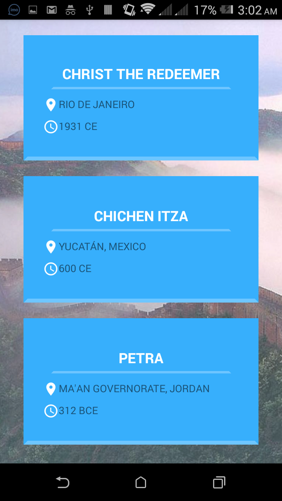
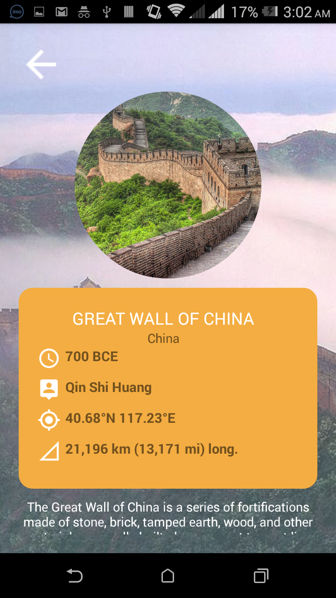
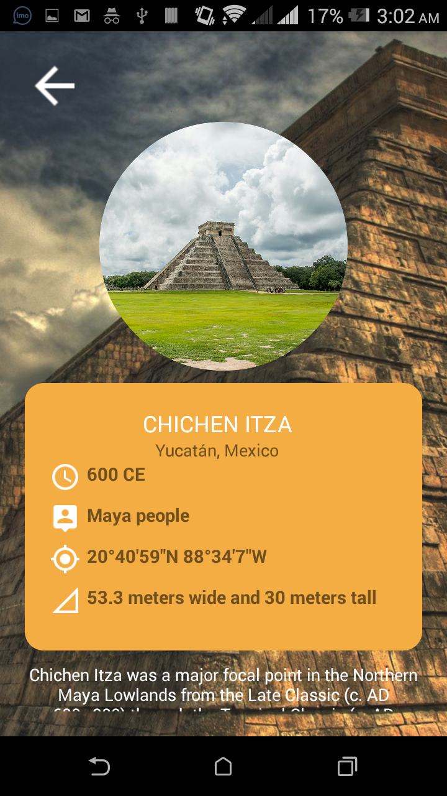
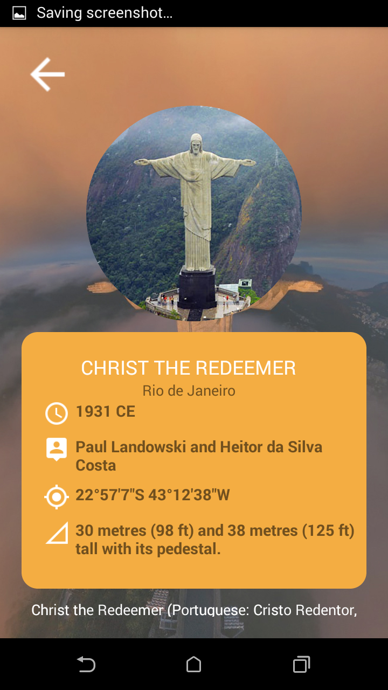
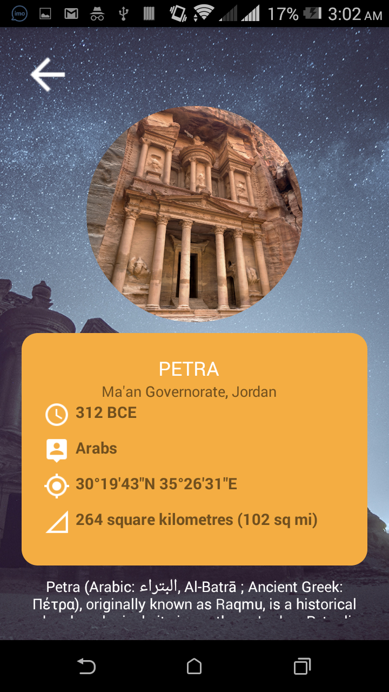
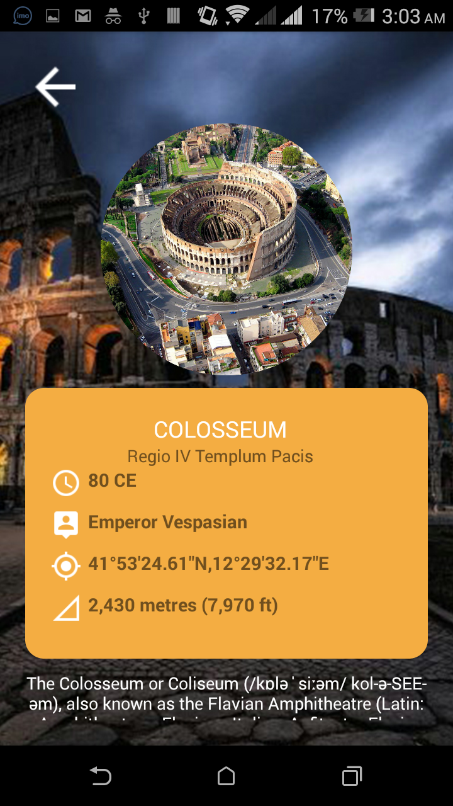
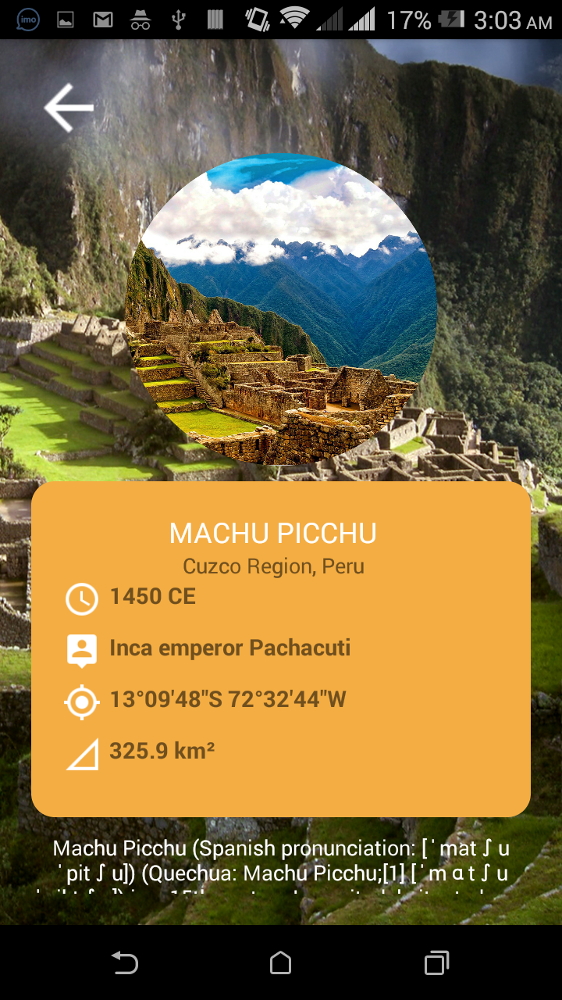
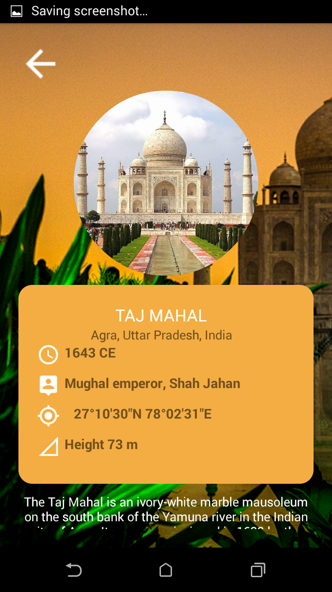

# seven_wonders_of_world
Seven wonder of world is react native project that designed for learn basics of react native

-> Images
-> Background Image
-> Flat List
-> Navigate between screens and pass data
-> Fetch data from JSON
-> ActivityIndicator
-> TouchableHighlight

#SCREENSHOTS

